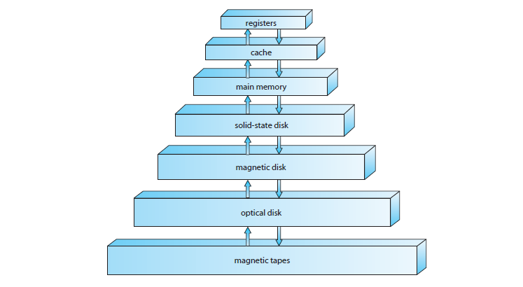

> Nama : Julita Hasanah  
> Nim : 2110131120005
> Prodi : Pendidikan Komputer

    

# **INTRODUCTION**

     

An <b>operating system</b> is a program that manages a computer’s hardware. It also provides a basis for application programs and acts as an intermediary between the computer user and the computer hardware. An amazing aspect of operating systems is how they vary in accomplishing these tasks. Mainframe operating systems are designed primarily to optimize utilization of hardware. Personal computer (PC) operating systems support complex games, business applications, and everything in between. Operating systems for mobile computers provide an environment in which a user can easily interface with the computer to execute programs. Thus, some operating systems are designed to be <i>convenient</i>, others to be <i>efficient</i>, and others to be some combination of the two.  
Before we can explore the details of computer system operation, we need to know something about system structure. We thus discuss the basic functions of system startup, I/O, and storage early in this chapter. We also describe the basic computer architecture that makes it possible to write a functional operating system.  
Because an operating system is large and complex, it must be created piece by piece. Each of these pieces should be a well-delineated portion of the system with carefully defined inputs, outputs, and functions. In this chapter, we provide a general overview of the major components of a contemporary computer system as well as the functions provided by the operating system. Additionally, we cover several other topics to help set the stage for the remainder of this text: data structures used in operating systems, computing environments, and open-source operating systems.

 

> ## CHAPTER OBJECTIVES
>
> - To describe the basic organization of computer systems.
> - To provide a grand tour of the major components of operating systems.
> - To give an overview of the many types of computing environments.
> - To explore several open-source operating systems.

 

  Figure 1.1 Abstract view of the components of a computer system.

 

## 1.1 What Operating Systems Do 

 We begin our discussion by looking at the operating system’s role in the overall computer system. A computer system can be divided roughly into four components: the <b>hardware</b>, the <i>operating system</i>, the <i>application programs</i>, and the <i>users</i> (Figure 1.1).  
The <b>hardware</b>—the <b>central processing unit (CPU)</b>, the <b>memory</b>, and the <b>input/output (I/O) devices</b>—provides the basic computing resources for the system. The <b>application</b> programs—such as word processors, spreadsheets, compilers, and Web browsers—define the ways in which these resources are used to solve users’ computing problems. The operating system controls the hardware and coordinates its use among the various application programs for the various users.  
We can also view a computer system as consisting of hardware, software, and data. The operating system provides the means for proper use of these resources in the operation of the computer system. An operating system is similar to a government. Like a government, it performs no useful function by itself. It simply provides an <i>environment</i> within which other programs can do useful work.  
To understand more fully the operating system’s role, we next explore operating systems from two viewpoints: that of the user and that of the system.
 

### **1.1.1 User View** 

The user’s view of the computer varies according to the interface being used. Most computer users sit in front of a PC, consisting of a monitor, keyboard, mouse, and system unit. Such a system is designed for one user to monopolize its resources. The goal is to maximize the work (or play) that the user is performing. In this case, the operating system is designed mostly for <b>ease of use</b>, with some attention paid to performance and none paid to <b>resource utilization</b>—how various hardware and software resources are shared Performance is, of course important to the user; but such systems are optimized for the single-user experience rather than the requirements of multiple users.   
In other cases, a user sits at a terminal connected to a <b>mainframe</b> or a <b>minicomputer</b>. Other users are accessing the same computer through other terminals. These users share resources and may exchange information. The operating system in such cases is designed to maximize resource utilization— to assure that all available CPU time, memory, and I/O are used efficiently and that no individual user takes more than her fair share.  
In still other cases, users sit at <b>workstations</b> connected to networks of other workstations and <b>servers</b>. These users have dedicated resources at their disposal, but they also share resources such as networking and servers, including file, compute, and print servers. Therefore, their operating system is designed to compromise between individual usability and resource utilization.   
Recently, many varieties of mobile computers, such as smartphones and tablets, have come into fashion. Most mobile computers are standalone units for individual users. Quite often, they are connected to networks through cellular or other wireless technologies Increasingly, thesemobile devices are replacing desktop and laptop computers for people who are primarily interested in using computers for e-mail and web browsing. The user interface for mobile computers generally features a <b>touch screen</b>, where the user interactswith the system by pressing and swiping fingers across the screen rather than using a physical keyboard and mouse.   
Some computers have little or no user view. For example, embedded computers in home devices and automobiles may have numeric keypads and may turn indicator lights on or off to show status, but they and their operating systems are designed primarily to run without user intervention.
 

### **1.1.2 System View** 

From the computer’s point of view, the operating system is the program most intimately involved with the hardware. In this context, we can view an operating system as a <b>resource allocator</b>. A computer system has many resources that may be required to solve a problem: CPU time, memory space, file-storage space, I/O devices, and so on. The operating system acts as the manager of these resources. Facing numerous and possibly conflicting requests for resources, the operating system must decidehow to allocate them to specific programs and users so that it can operate the computer system efficiently and fairly.Aswe have seen, resource allocation is especially important where many users access the same mainframe or minicomputer.  
A slightly different view of an operating system emphasizes the need to control the various I/O devices and user programs. An operating system is a control program. <b>A control</b> program manages the execution of user programs to prevent errors and improper use of the computer. It is especially concerned
with the operation and control of I/O devices.

### **1.1.3 Defining Operating Systems** 

 now, you can probably see that the term <i>operating system</i> covers many roles and functions. That is the case, at least in part, because of the myriad designs and uses of computers. Computers are present within toasters, cars, ships, spacecraft, homes, and businesses. They are the basis for game machines, music players, cable TV tuners, and industrial control systems. Although computers have a relatively short history, they have evolved rapidly. Computing started as an experiment to determine what could be done and quickly moved to fixed-purpose systems for military uses, such as code breaking and trajectory plotting, and governmental uses, such as census calculation. Those early computers evolved into general-purpose, multifunction mainframes, and that’s when operating systems were born. In the 1960s, <b>Moore’s Law</b> predicted that the number of transistors on an integrated circuit would double every eighteen months, and that prediction has held true. Computers gained in functionality and shrunk in size, leading to a vast number of uses and a vast number and variety of operating systems. (See Chapter 20 for more details on the history of operating systems.)  
How, then, can we define what an operating system is? In general, we have no completely adequate definition of an operating system. Operating systems exist because they offer a reasonable way to solve the problem of creating a usable computing system. The fundamental goal of computer systems is to execute user programs and to make solving user problems easier. Computer hardware is constructed toward this goal. Since bare hardware alone is not particularly easy to use, application programs are developed. These programs require certain common operations, such as those controlling the I/O devices. The common functions of controlling and allocating resources are then brought together into one piece of software: the operating system.  
In addition,wehave no universally accepted definition of what is part of the operating system. A simple viewpoint is that it includes everything a vendor ships when you order “the operating system.” The features included, however, vary greatly across systems. Some systems take up less than a megabyte of space and lack even a full-screen editor, whereas others require gigabytes of space and are based entirely on graphical windowing systems.Amore common definition, and the one that we usually follow, is that the operating system is the one program running at all times on the computer—usually called the <b>kernel</b>. (Along with the kernel, there are two other types of programs: <b>system programs</b>, which are associatedwith the operating system but are not necessarily part of the kernel, and application programs, which include all programs not associated with the operation of the system.)  
The matter of what constitutes an operating system became increasingly important as personal computers became more widespread and operating systems grew increasingly sophisticated. In 1998, the United States Department of Justice filed suit against Microsoft, in essence claiming that Microsoft included too much functionality in its operating systems and thus prevented application vendors from competing. (For example, a Web browser was an integral part of the operating systems.) As a result, Microsoft was found guilty of using its operating-system monopoly to limit competition.  
Today, however, if we look at operating systems for mobile devices, we see that once again the number of features constituting the operating system is increasing. Mobile operating systems often include not only a core kernel but also <b>middleware</b>—a set of software frameworks that provide additional services to application developers. For example, each of the two most prominent mobile operating systems—Apple’s iOS and Google’s Android—features a core kernel alongwithmiddleware that supportsdatabases,multimedia, and graphics (to name a only few).

 

## **1.2 Computer-System Organization**

Before we can explore the details of how computer systems operate, we need general knowledge of the structure of a computer system. In this section, we look at several parts of this structure. The section is mostly concerned with computer-system organization, so you can skim or skip it if you already understand the concepts. 

### **1.2.1 Computer-System Operation**  

A modern general-purpose computer system consists of one or more CPUs and a number of device controllers connected through a common bus that provides access to shared memory (Figure 1.2). Each device controller is in charge of a specific type of device (for example, disk drives, audio devices, or video displays). The CPU and the device controllers can execute in parallel, competing for memory cycles. To ensure orderly access to the shared memory, a memory controller synchronizes access to the memory.  
For a computer to start running—for instance, when it is powered up or rebooted—it needs to have an initial program to run. This initial program, or <b>bootstrap program</b>, tends to be simple. Typically, it is stored within the computer hardware in read-only memory (<b>ROM</b>) or electrically erasable programmable read-only memory (<b>EEPROM</b>), known by the general term <b>firmware</b>. It initializes all aspects of the system, from CPU registers to device controllers tomemorycontents. The bootstrap program mustknowhowto load the operating system and how to start executing that system. To accomplish 
 

 Figure 1.2 A modern computer system.   
 Figure 1.3 Interrupt timeline for a single process doing output.   

this goal, the bootstrap program must locate the operating-system kernel and load it into memory. 
Once the kernel is loaded and executing, it can start providing services to the system and its users. Some services are provided outside of the kernel, by system programs that are loaded into memory at boot time to become <b>system processes</b>, or <b>system daemons</b> that run the entire time the kernel is running. On UNIX, the first systemprocess is “init,” and it starts many other daemons. Once this phase is complete, the system is fully booted, and the system waits for some event to occur.  
The occurrence of an event is usually signaled by an <b>interrupt</b> from either the hardware or the software. Hardware may trigger an interrupt at any time by sending a signal to the CPU, usually by way of the system bus. Software may trigger an interrupt by executing a special operation called a <b>system call</b> (also called a <b>monitor call</b>).  
When the CPU is interrupted, it stops what it is doing and immediately transfers execution to a fixed location. The fixed location usually contains the starting address where the service routine for the interrupt is located. The interrupt service routine executes; on completion, the CPU resumes the interrupted computation. A timeline of this operation is shown in Figure 1.3.  
Interrupts are an important part of a computer architecture. Each computer design has its own interrupt mechanism, but several functions are common. The interrupt must transfer control to the appropriate interrupt service routine. The straightforward method for handling this transfer would be to invoke a generic routine to examine the interrupt information. The routine, in turn, would call the interrupt-specific handler.However, interrupts must be handled quickly. Since only a predefined number of interrupts is possible, a table of pointers to interrupt routines can be used instead to provide the necessary speed. The interrupt routine is called indirectly through the table, with no intermediate routine needed. Generally, the table of pointers is stored in low memory (the first hundred or so locations). These locations hold the addresses of the interrupt service routines for the various devices. This array, or <b>interrupt</b> vector, of addresses is then indexed by a unique device number, given with the interrupt request, to provide the address of the interrupt service routine for
  

> 
 <b>STORAGE DEFINITIONS AND NOTATION</b> 

> 
The basic unit of computer storage is the <b>bit</b>. A bit can contain one of two values, 0 and 1. All other storage in a computer is based on collections of bits. Given enough bits, it is amazing how many things a computer can represent: numbers, letters, images, movies, sounds, documents, and programs, to name a few. A <b>byte</b> is 8 bits, and on most computers it is the smallest convenient chunk of storage. For example, most computers don’t have an instruction to move a bit but do have one to move a byte. A less common term is <b>word</b>, which is a given computer architecture’s native unit of data. A word is made up of one or more bytes. For example, a computer that has 64-bit registers and 64-bit memory addressing typically has 64-bit (8-byte) words. A computer executes many operations in its native word size rather than a byte at a time.    Computer storage, along with most computer throughput, is generally measured and manipulated in bytes and collections of bytes. A <b>kilobyte</b> or <b>KB</b>, is 1,024 bytes; a <b>megabyte</b>, or <b>MB</b>, is 1,024^2 bytes; a <b>gigabyte</b>, or <b>GB</b>, is 1,024^3 bytes; a <b>terabyte</b>, or <b>TB</b>, is 1,024^4 bytes; and a <b>petabyte</b>, or <b>PB</b>, is 1,024^5 bytes. Computer manufacturers often round off these numbers and say that a megabyte is 1 million bytes and a gigabyte is 1 billion bytes. Networking measurements are an exception to this general rule; they are given in bits (because networks move data a bit at a time).

 

the interrupting device. Operating systems as different as Windows and UNIX dispatch interrupts in this manner. 
The interrupt architecture must also save the address of the interrupted instruction. Many old designs simply stored the interrupt address in a fixed location or in a location indexed by the device number. More recent architectures store the return address on the system stack. If the interrupt routine needs to modify the processor state—for instance, by modifying register values—it must explicitly save the current state and then restore that state before returning. After the interrupt is serviced, the saved return address is loaded into the program counter, and the interrupted computation resumes as though the interrupt had not occurred. 

### **1.2.2 Storage Structure**

The CPU can load instructions only from memory, so any programs to run must be stored there. General-purpose computers run most of their programs from rewritable memory, called main memory (also called random-access memory, or <b>RAM</b>). Main memory commonly is implemented in a semiconductor technology called <b>dynamic random-access memory (DRAM)</b>.  
Computers use other forms of memory as well.We have already mentioned read-only memory, ROM) and electrically erasable programmable read-only memory, EEPROM). BecauseROM cannot be changed, only static programs, such as the bootstrap program described earlier, are stored there. The immutability of ROM is of use in game cartridges. EEPROM can be changed but cannot be changed frequently and so contains mostly static programs. For example, smartphones have EEPROM to store their factory-installed programs.  
All forms of memory provide an array of bytes. Each byte has its own address. Interaction is achieved through a sequence of load or store instructions to specific memory addresses. The load instruction moves a byte or word from main memory to an internal register within the CPU, whereas the store instruction moves the content of a register to main memory. Aside from explicit loads and stores, the CPU automatically loads instructions from main memory for execution.  
A typical instruction–execution cycle, as executed on a systemwith a <b>von Neumann architecture</b>, first fetches an instruction from memory and stores that instruction in the <b>instruction register</b>. The instruction is then decoded and may cause operands to be fetched from memory and stored in some internal register. After the instruction on the operands has been executed, the result may be stored back in memory. Notice that the memory unit sees only a streamofmemory addresses. It does not know how they are generated (by the instruction counter, indexing, indirection, literal addresses, or some other means) or what they are for (instructions or data). Accordingly, we can ignore how a memory address is generated by a program.We are interested only in the sequence of memory addresses generated by the running program.  
Ideally, we want the programs and data to reside in main memory permanently. This arrangement usually is not possible for the following two reasons: 

1. Main memory is usually too small to store all needed programs and data
   permanently.
2. Main memory is a volatile storage device that loses its contents when power is turned off or otherwise lost.

 

Thus, most computer systems provide <b>secondary storage</b> as an extension of main memory. The main requirement for secondary storage is that it be able to hold large quantities of data permanently.  
The most common secondary-storage device is a magnetic disk, which provides storage for both programs and data. Most programs (system and application) are stored on a disk until they are loaded into memory. Many programs then use the disk as both the source and the destination of their processing. Hence, the proper management of disk storage is of central importance to a computer system, as we discuss in Chapter 10  
In a larger sense, however, the storage structure that we have described— consisting of registers, main memory, and magnetic disks—is only one of many possible storage systems. Others include cache memory, CD-ROM, magnetic tapes, and so on. Each storage system provides the basic functions of storing a datumand holding that datumuntil it is retrieved at a later time. Themain differences among the various storage systems lie in speed, cost, size, and volatility.  
The wide variety of storage systems can be organized in a hierarchy (Figure 1.4) according to speed and cost. The higher levels are expensive, but they are fast. As we move down the hierarchy, the cost per bit generally decreases, whereas the access time generally increases. This trade-off is reasonable; if a given storage system were both faster and less expensive than another—other properties being the same—then there would be no reason to use the slower, more expensive memory. In fact, many early storage devices, including paper

 

 Figure 1.4 Storage-device hierarchy.  

tape and core memories, are relegated to museums now that magnetic tape and <b>semiconductor memory</b> have become faster and cheaper. The top four levels of memory in Figure 1.4 may be constructed using semiconductor memory.   
In addition to differing in speed and cost, the various storage systems are either volatile or nonvolatile. As mentioned earlier, <b>volatile storage</b> loses its contents when the power to the device is removed. In the absence of expensive battery and generator backup systems, data must be written to <b>nonvolatile storage</b> for safekeeping. In the hierarchy shown in Figure 1.4, the storage systems above the solid-state disk are volatile, whereas those including the solid-state disk and below are nonvolatile.   
<b>Solid-state disks</b> have several variants but in general are faster than magnetic disks and are nonvolatile. One type of solid-state disk stores data in a largeDRAM array during normal operation but also contains a hidden magnetic hard disk and a battery for backup power. If external power is interrupted, this solid-state disk’s controller copies the data from RAM to the magnetic disk. When external power is restored, the controller copies the data back into RAM. Another form of solid-state disk is flash memory, which is popular in cameras and <b>personal digital assistants (PDAs)</b>, in robots, and increasingly for storage on general-purpose computers. Flash memory is slower than DRAM but needs no power to retain its contents. Another form of nonvolatile storage is <b>NVRAM</b>, which is DRAM with battery backup power. This memory can be as fast as DRAM and (as long as the battery lasts) is nonvolatile.   
The design of a complete memory system must balance all the factors just discussed: it must use only as much expensive memory as necessary while providing as much inexpensive, nonvolatile memory as possible. Caches can be installed to improve performance where a large disparity in access time or transfer rate exists between two components. 

### **1.2.3 I/O Structure** 

Storage is only one of many types of I/O devices within a computer. A large portion of operating system code is dedicated to managing I/O, both because of its importance to the reliability and performance of a system and because of the varying nature of the devices. Next, we provide an overview of I/O.  
A general-purpose computer systemconsists of CPUs andmultiple device controllers that are connected through a common bus. Each device controller is in charge of a specific type of device. Depending on the controller, more than one device may be attached. For instance, seven or more devices can be attached to the <b>small computer-systems interface (SCSI)</b> controller. A device controller maintains some local buffer storage and a set of special-purpose registers. The device controller is responsible for moving the data between the peripheral devices that it controls and its local buffer storage. Typically, operating systems have a <b>device driver</b> for each device controller. This device driver understands the device controller and provides the rest of the operating system with a uniform interface to the device.  
To start an I/O operation, the device driver loads the appropriate registers within the device controller. The device controller, in turn, examines the contents of these registers to determine what action to take (such as “read a character fromthe keyboard”). The controller starts the transfer of data from the device to its local buffer. Once the transfer of data is complete, the device controller informs the device driver via an interrupt that it has finished its operation. The device driver then returns control to the operating system, possibly returning the data or a pointer to the data if the operation was a read. For other operations, the device driver returns status information.  
This form of interrupt-driven I/O is fine for moving small amounts of data but can produce high overhead when used for bulk data movement such as disk I/O. To solve this problem, <b>direct memory access (DMA)</b> is used. After setting up buffers, pointers, and counters for the I/O device, the device controller transfers an entire block of data directly to or from its own buffer storage to memory, with no intervention by the CPU. Only one interrupt is generated per block, to tell the device driver that the operation has completed, rather than the one interrupt per byte generated for low-speed devices.While the device controller is performing these operations, the CPU is available to accomplish other work.  
Some high-end systems use switch rather than bus architecture. On these systems, multiple components can talk to other components concurrently, rather than competing for cycles on a shared bus. In this case, DMA is even more effective. Figure 1.5 shows the interplay of all components of a computer system.  

## **1.3 Computer-System Architecture**

In Section 1.2,weintroduced the general structure of a typical computer system. A computer system can be organized in a number of different ways, which we

 

 can categorize roughly according to the number of general-purpose processors used.  

### **1.3.1 Single-Processor Systems**  

Until recently, most computer systems used a single processor. On a singleprocessor system, there is one main CPUcapable of executing a general-purpose instruction set, including instructions from user processes. Almost all singleprocessor systems have other special-purpose processors as well. They may come in the form of device-specific processors, such as disk, keyboard, and graphics controllers; or, on mainframes, they may come in the form of more general-purpose processors, such as I/O processors that move data rapidly among the components of the system.  
All of these special-purpose processors run a limited instruction set and do not run user processes. Sometimes, they are managed by the operating system, in that the operating system sends them information about their next task and monitors their status. For example, a disk-controller microprocessor receives a sequence of requests fromthemain CPU and implements its own disk queue and scheduling algorithm. This arrangement relieves the main CPU of the overhead of disk scheduling. PCs contain amicroprocessor in the keyboard to convert the keystrokes into codes to be sent to the CPU. In other systems or circumstances, special-purpose processors are low-level components built into the hardware. The operating system cannot communicate with these processors; they do their jobs autonomously. The use of special-purpose microprocessors is common and does not turn a single-processor system into a multiprocessor. If there is only one general-purpose CPU, then the system is a single-processor system. 

### **1.3.2 Multiprocessor Systems**  

Within the past several years, <b>multiprocessor systems</b> (also known as <b>parallel systems or multicore systems</b>) have begun to dominate the landscape of computing. Such systems have two or more processors in close communication, sharing the computer bus and sometimes the clock, memory, and peripheral devices. Multiprocessor systems first appeared prominently appeared in servers and have since migrated to desktop and laptop systems. Recently, multiple processors have appeared on mobile devices such as smartphones and tablet computers.  
Multiprocessor systems have three main advantages:

1. **Increased throughput**. 
 Byincreasing the number of processors,we expect to get more work done in less time. The speed-up ratio with N processors is not N, however; rather, it is less than N. When multiple processors cooperate on a task, a certain amount of overhead is incurred in keeping all the parts working correctly. This overhead, plus contention for shared resources, lowers the expected gain fromadditional processors. Similarly, N programmers working closely together do not produce N times the amount of work a single programmer would produce.

2. **Economy of scale**. 
 Multiprocessor systems can cost less than equivalent multiple single-processor systems, because they can share peripherals, mass storage, and power supplies. If several programs operate on the same set of data, it is cheaper to store those data on one disk and to have all the processors share them than to have many computers with local disks and many copies of the data.

3. **Increased reliability**. 
 If functions can be distributed properly among several processors, then the failure of one processor will not halt the system, only slow it down. If we have ten processors and one fails, then each of the remaining nine processors can pick up a share of the work of the failed processor. Thus, the entire system runs only 10 percent slower, rather than failing altogether.

Increased reliability of a computer system is crucial in many applications. The ability to continue providing service proportional to the level of surviving hardware is called <b>graceful degradation</b>. Some systems go beyond graceful degradation and are called <b>fault tolerant</b>, because they can suffer a failure of any single component and still continue operation. Fault tolerance requires a mechanism to allow the failure to be detected, diagnosed, and, if possible, corrected. The HP NonStop (formerly Tandem) system uses both hardware and software duplication to ensure continued operation despite faults. The system consists of multiple pairs of CPUs, working in lockstep. Both processors in the pair execute each instruction and compare the results. If the results differ, then one CPU of the pair is at fault, and both are halted. The process that was being executed is then moved to another pair of CPUs, and the instruction that failed is restarted. This solution is expensive, since it involves special hardware and considerable hardware duplication.  
The multiple-processor systems in use today are of two types. Some systems use <b>asymmetric multiprocessing</b>, in which each processor is assigned a specific task.Aboss processor controls the system; the other processors either look to the boss for instruction or have predefined tasks. This scheme defines a boss–worker relationship. The boss processor schedules and allocates work to the worker processors.  
The most common systems use <b>symmetric multiprocessing (SMP)</b>, in which each processor performs all tasks within the operating system. SMP means that all processors are peers; no boss–worker relationship exists between processors. Figure 1.6 illustrates a typical SMP architecture. Notice that each processor has its own set of registers, as well as a private—or local —cache. However, all processors share physical memory. An example of an SMP system is AIX, a commercial version of UNIX designed by IBM. An AIX system can be configured to employ dozens of processors. The benefit of this model is that many processes can run simultaneously—N processes can run if there are N CPUs—without causing performance to deteriorate significantly. However, we must carefully control I/O to ensure that the data reach the appropriate processor. Also, since the CPUs are separate, one may be sitting idle while another is overloaded, resulting in inefficiencies. These inefficiencies can be avoided if the processors share certain data structures.Amultiprocessor system of this form will allow processes and resources—such as memory— to be shared dynamically among the various processors and can lower the variance among the processors. Such a system must be written carefully, as we shall see in Chapter 5. Virtually all modern operating systems—including Windows, Mac OS X, and Linux—nowprovide support for SMP.<br. 
The difference between symmetric and asymmetric multiprocessing may result fromeither hardware or software. Special hardware can differentiate the multiple processors, or the software can be written to allow only one boss and multiple workers. For instance, Sun Microsystems’ operating system SunOS Version 4 provided asymmetric multiprocessing, whereas Version 5 (Solaris) is symmetric on the same hardware.  
Multiprocessing adds CPUs to increase computing power. If the CPU has an integrated memory controller, then adding CPUs can also increase the amount
 

  Figure 1.6 Symmetric multiprocessing architecture. 

of memory addressable in the system. Either way, multiprocessing can cause a system to change its memory access model from uniform memory access (UMA) to non-uniformmemory access (<b>NUMA</b>). UMA is defined as the situation in which access to any RAM from any CPU takes the same amount of time.With NUMA, some parts of memory may take longer to access than other parts, creating a performance penalty. Operating systems can minimize the NUMA penalty through resource management, as discussed in Section 9.5.4.  
A recent trend in CPU design is to include multiple computing <b>cores</b> on a single chip. Such multiprocessor systems are termed <b>multicore</b>. They can be more efficient than multiple chips with single cores because on-chip communication is faster than between-chip communication. In addition, one chip with multiple cores uses significantly less power than multiple single-core chips.  
It is important to note that while multicore systems are multiprocessor systems, not all multiprocessor systems are multicore, as we shall see in Section 1.3.3. In our coverage of multiprocessor systems throughout this text, unless we state otherwise, we generally use the more contemporary term <i>multicore</i>, which excludes some multiprocessor systems.  
In Figure 1.7, we show a dual-core design with two cores on the same chip. In this design, each core has its own register set as well as its own local cache. Other designs might use a shared cache or a combination of local and shared caches. Aside from architectural considerations, such as cache, memory, and bus contention, these multicore CPUs appear to the operating system as N standard processors. This characteristic puts pressure on operating system designers—and application programmers—to make use of those processing cores.  
Finally, <b>blade servers</b> are a relatively recent development in which multiple processor boards, I/O boards, and networking boards are placed in the same chassis. The difference between these and traditional multiprocessor systems is that each blade-processor board boots independently and runs its own operating system. Some blade-server boards are multiprocessor as well, which blurs the lines between types of computers. In essence, these servers consist of multiple independent multiprocessor systems.
 

  Figure 1.7 A dual-core design with two cores placed on the same chip.  

### **1.3.3 Clustered Systems**

Another type of multiprocessor system is a <b>clustered system</b>, which gathers together multiple CPUs. Clustered systems differ from the multiprocessor systems described in Section 1.3.2 in that they are composed of two or more individual systems—or nodes—joined together. Such systems are considered <b>loosely coupled</b>. Each node may be a single processor system or a multicore system. We should note that the definition of clustered is not concrete; many commercial packages wrestle to define a clustered system and why one form is better than another. The generally accepted definition is that clustered computers share storage and are closely linked via a local-area network LAN (as described in Chapter 17) or a faster interconnect, such as InfiniBand.  
Clustering is usually used to provide <b>high-availability</b> service—that is, service will continue even if one or more systems in the cluster fail. Generally, we obtain high availability by adding a level of redundancy in the system. A layer of cluster software runs on the cluster nodes. Each node can monitor one or more of the others (over the LAN). If the monitored machine fails, the monitoring machine can take ownership of its storage and restart the applications that were running on the failed machine. The users and clients of the applications see only a brief interruption of service.  
Clustering can be structured asymmetrically or symmetrically. In <b>asymmetric clustering</b>, one machine is in <b>hot-standby mode</b> while the other is running the applications. The hot-standby host machine does nothing but monitor the active server. If that server fails, the hot-standby host becomes the active server. In <b>symmetric clustering</b>, two or more hosts are running applications and are monitoring each other. This structure is obviously more efficient, as it uses all of the available hardware. However it does require that more than one application be available to run.  
Since a cluster consists of several computer systems connected via a network, clusters can also be used to provide <b>high-performance computing</b> environments. Such systems can supply significantly greater computational power than single-processor or even SMP systems because they can run an application concurrently on all computers in the cluster. The application must have been written specifically to take advantage of the cluster, however. This involves a technique known as <b>parallelization</b>, which divides a programinto separate components that run in parallel on individual computers in the cluster. Typically, these applications are designed so that once each computing node in the cluster has solved its portion of the problem, the results from all the nodes are combined into a final solution.  
Other forms of clusters include parallel clusters and clustering over a wide-area network (WAN) (as described in Chapter 17). Parallel clusters allow multiple hosts to access the same data on shared storage. Because most operating systems lack support for simultaneous data access by multiple hosts, parallel clusters usually require the use of special versions of software and special releases of applications. For example, Oracle Real Application Cluster is a version of Oracle’s database that has been designed to run on a parallel cluster. Each machine runs Oracle, and a layer of software tracks access to the shared disk. Each machine has full access to all data in the database. To provide this shared access, the system must also supply access control and locking to

> 
 <b>BEOWULF CLUSTERS</b> 

> 
Beowulf clusters are designed to solve high-performance computing tasks. A Beowulf cluster consists of commodity hardware—such as personal computers—connected via a simple local-area network. No single specific software package is required to construct a cluster. Rather, the nodes use a set of open-source software libraries to communicate with one another. Thus, there are a variety of approaches to constructing a Beowulf cluster. Typically, though, Beowulf computing nodes run the Linux operating system. Since Beowulf clusters require no special hardware and operate using open-source software that is available free, they offer a low-cost strategy for building a high-performance computing cluster. In fact, some Beowulf clusters built from discarded personal computers are using hundreds of nodes to solve computationally expensive scientific computing problems.

ensure that no conflicting operations occur. This function, commonly known as a <b>distributed lock manager (DLM)</b>, is included in some cluster technology.  
Cluster technology is changing rapidly. Some cluster products support dozens of systems in a cluster, as well as clustered nodes that are separated by miles. Many of these improvements are made possible by <b?>storage-area networks (SANs)</b>, as described in Section 10.3.3, which allow many systems to attach to a pool of storage. If the applications and their data are stored on the SAN, then the cluster software can assign the application to run on any host that is attached to the SAN. If the host fails, then any other host can take over. In a database cluster, dozens of hosts can share the same database, greatly increasing performance and reliability. Figure 1.8 depicts the general structure of a clustered system.

   Figure 1.8 General structure of a clustered system.
  

| operating system |
| :--------------: |
|      job 1       |
|      job 2       |
|      job 3       |
|      job 4       |

##### Figure 1.9 Memory layout for a multiprogramming system.  

## **1.4 Operating-System Structure**

Now that we have discussed basic computer-system organization and architecture, we are ready to talk about operating systems. An operating system provides the environment within which programs are executed. Internally, operating systems vary greatly in their makeup, since they are organized along many different lines. There are, however, many commonalities, which we consider in this section.  
One of the most important aspects of operating systems is the ability to multiprogram. A single program cannot, in general, keep either the CPU or the I/O devices busy at all times. Single users frequently have multiple programs running. <b>Multiprogramming</b> increases CPUutilization by organizing jobs (code and data) so that the CPU always has one to execute.  
The idea is as follows: The operating system keeps several jobs in memory simultaneously (Figure 1.9). Since, in general, main memory is too small to accommodate all jobs, the jobs are kept initially on the disk in the <b>job pool</b>. This pool consists of all processes residing on disk awaiting allocation of main memory.  
The set of jobs in memory can be a subset of the jobs kept in the job pool. The operating system picks and begins to execute one of the jobs in memory. Eventually, the job may have to wait for some task, such as an I/O operation, to complete. In a non-multiprogrammed system, the CPU would sit idle. In a multiprogrammed system, the operating system simply switches to, and executes, another job. When that job needs to wait, the CPU switches to another job, and so on. Eventually, the first job finishes waiting and gets the CPU back. As long as at least one job needs to execute, the CPU is never idle.  
This idea is common in other life situations. A lawyer does not work for only one client at a time, for example. While one case is waiting to go to trial or have papers typed, the lawyer can work on another case. If he has enough clients, the lawyer will never be idle for lack of work. (Idle lawyers tend to become politicians, so there is a certain social value in keeping lawyers busy.)  
Multiprogrammed systems provide an environment in which the various system resources (for example, CPU, memory, and peripheral devices) are utilized effectively, but they do not provide for user interaction with the computer system. <b>Time sharing</b> (or <b>multitasking</b>) is a logical extension of multiprogramming. In time-sharing systems, the CPU executes multiple jobs by switching among them, but the switches occur so frequently that the users can interact with each program while it is running.  
Time sharing requires an <b>interactive</b> computer system, which provides direct communication between the user and the system. The user gives instructions to the operating system or to a program directly, using a input device such as a keyboard, mouse, touch pad, or touch screen, and waits for immediate results on an output device. Accordingly, the <b>response time</b> should be short—typically less than one second.  
A time-shared operating systemallowsmany users to share the computer simultaneously. Since each action or command in a time-shared system tends to be short, only a little CPU time is needed for each user.As the system switches rapidly from one user to the next, each user is given the impression that the entire computer system is dedicated to his use, even though it is being shared among many users.   
A time-shared operating systemuses CPU scheduling and multiprogramming to provide each user with a small portion of a time-shared computer. Each user has at least one separate program in memory.Aprogram loaded into memory and executing is called a <b>process</b>.Whenaprocess executes, it typically executes for only a short time before it either finishes or needs to performI/O. I/O may be interactive; that is, output goes to a display for the user, and input comes from a user keyboard, mouse, or other device. Since interactive I/O typically runs at “people speeds,” it may take a long time to complete. Input, for example, may be bounded by the user’s typing speed; seven characters per second is fast for people but incredibly slow for computers. Rather than let the CPU sit idle as this interactive input takes place, the operating system will rapidly switch the CPU to the program of some other user.   
Time sharing and multiprogramming require that several jobs be kept simultaneously in memory. If several jobs are ready to be brought into memory, and if there is not enough room for all of them, then the system must choose among them. Making this decision involves <b?>job scheduling</b>, whichwe discuss in Chapter 6. When the operating system selects a job from the job pool, it loads that job into memory for execution. Having several programs in memory at the same time requires some form of memory management, which we cover in Chapters 8 and 9. In addition, if several jobs are ready to run at the same time, the system must choose which job will run first. Making this decision is <b>CPU scheduling</b>, which is also discussed in Chapter 6. Finally, running multiple jobs concurrently requires that their ability to affect one another be limited in all phases of the operating system, including process scheduling, disk storage, and memory management. We discuss these considerations throughout the text.  
In a time-sharing system, the operating system must ensure reasonable response time. This goal is sometimes accomplished through <b>swapping</b>, whereby processes are swapped in and out of main memory to the disk.Amore common method for ensuring reasonable response time is <b>virtual memory</b>, a technique that allows the execution of a process that is not completely in memory (Chapter 9). The main advantage of the virtual-memory scheme is that it enables users to run programs that are larger than actual <b>physical memory</b>. Further, it abstracts main memory into a large, uniform array of storage, separating <b>logical memory</b> as viewed by the user from physical memory. This arrangement frees programmers from concern over memory-storage limitations.  
A time-sharing system must also provide a file system (Chapters 11 and 12). The file system resides on a collection of disks; hence, disk management must be provided (Chapter 10). In addition, a time-sharing system provides a mechanism for protecting resources from inappropriate use (Chapter 14). To ensure orderly execution, the system must provide mechanisms for job synchronization and communication (Chapter 5), and it may ensure that jobs do not get stuck in a deadlock, forever waiting for one another (Chapter 7).

 

## **1.5 Operating-System Operations**

As mentioned earlier, modern operating systems are <b>interrupt driven</b>. If there are no processes to execute, no I/O devices to service, and no users to whom to respond, an operating system will sit quietly, waiting for something to happen. Events are almost always signaled by the occurrence of an interrupt or a trap. A <b>trap</b> (or an <b>exception</b>) is a software-generated interrupt caused either by an error (for example, division by zero or invalid memory access) or by a specific request from a user program that an operating-system service be performed. The interrupt-driven nature of an operating system defines that system’s general structure. For each type of interrupt, separate segments of code in the operating system determine what action should be taken. An interrupt service routine is provided to deal with the interrupt.   
Since the operating system and the users share the hardware and software resources of the computer system, we need to make sure that an error in a user program could cause problems only for the one program running. With sharing, many processes could be adversely affected by a bug in one program. For example, if a process gets stuck in an infinite loop, this loop could prevent the correct operation of many other processes. More subtle errors can occur in a multiprogramming system, where one erroneous program might modify another program, the data of another program, or even the operating system itself.   
Without protection against these sorts of errors, either the computer must execute only one process at a time or all output must be suspect. A properly designed operating system must ensure that an incorrect (or malicious) program cannot cause other programs to execute incorrectly.

### **1.5.1 Dual-Mode and Multimode Operation**

In order to ensure the proper execution of the operating system, we must be able to distinguish between the execution of operating-system code and userdefined code. The approach taken by most computer systems is to provide hardware support that allows us to differentiate among various modes of execution.
 

   Figure 1.10 Transition from user to kernel mode. 
  

At the very least, we need two separate modes of operation: <b>user mode</b> and kernel mode (also called <b>supervisor mode</b>, <b>system mode</b>, or <b>privileged mode</b>). A bit, called the <b>mode bit</b>, is added to the hardware of the computer to indicate the current mode: kernel (0) or user (1). With the mode bit, we can distinguish between a task that is executed on behalf of the operating system and one that is executed on behalf of the user. When the computer system is executing on behalf of a user application, the system is in user mode. However, when a user application requests a service from the operating system (via a system call), the system must transition from user to kernel mode to fulfill the request. This is shown in Figure 1.10. As we shall see, this architectural enhancement is useful for many other aspects of system operation as well.   
At system boot time, the hardware starts in kernel mode. The operating system is then loaded and starts user applications in user mode. Whenever a trap or interrupt occurs, the hardware switches from user mode to kernel mode (that is, changes the state of the mode bit to 0). Thus, whenever the operating system gains control of the computer, it is in kernel mode. The system always switches to user mode (by setting the mode bit to 1) before passing control to a user program.   
The dual mode of operation provides us with the means for protecting the operating system from errant users—and errant users from one another. We accomplish this protection by designating some of the machine instructions that may cause harm as <b>privileged instructions</b>. The hardware allows privileged instructions to be executed only in kernel mode. If an attempt is made to execute a privileged instruction in user mode, the hardware does not execute the instruction but rather treats it as illegal and traps it to the operating system.   
The instruction to switch to kernel mode is an example of a privileged instruction. Some other examples include I/O control, timer management, and interrupt management. As we shall see throughout the text, there are many additional privileged instructions.   
The concept of modes can be extended beyond two modes (in which case the CPU uses more than one bit to set and test the mode). CPUs that support virtualization (Section 16.1) frequently have a separate mode to indicate when the <b>virtual machine manager (VMM)</b>—and the virtualization management software—is in control of the system. In this mode, the VMM has more privileges than user processes but fewer than the kernel. It needs that level of privilege so it can create and manage virtual machines, changing the CPU state to do so. Sometimes, too, different modes are used by various kernel components.We should note that, as an alternative to modes, the CPU designer may use other methods to differentiate operational privileges. The Intel 64 family of CPUs supports four privilege levels, for example, and supports virtualization but does not have a separate mode for virtualization.   
We can now see the life cycle of instruction execution in a computer system. Initial control resides in the operating system, where instructions are executed in kernel mode. When control is given to a user application, the mode is set to user mode. Eventually, control is switched back to the operating system via an interrupt, a trap, or a system call.  
System calls provide the means for a user program to ask the operating system to perform tasks reserved for the operating system on the user program’s behalf. A system call is invoked in a variety of ways, depending on the functionality provided by the underlying processor. In all forms, it is the method used by a process to request action by the operating system. A system call usually takes the form of a trap to a specific location in the interrupt vector. This trap can be executed by a generic trap instruction, although some systems (such as MIPS) have a specific syscall instruction to invoke a system call.   
When a system call is executed, it is typically treated by the hardware as a software interrupt. Control passes through the interrupt vector to a service routine in the operating system, and the mode bit is set to kernel mode. The system-call service routine is a part of the operating system. The kernel examines the interrupting instruction to determine what system call has occurred; a parameter indicates what type of service the user program is requesting. Additional information needed for the request may be passed in registers, on the stack, or in memory (with pointers to the memory locations passed in registers). The kernel verifies that the parameters are correct and legal, executes the request, and returns control to the instruction following the system call.We describe system calls more fully in Section 2.3.   
The lack of a hardware-supported dual mode can cause serious shortcomings in an operating system. For instance, MS-DOS was written for the Intel 8088 architecture, which has no mode bit and therefore no dual mode. A user program running awry can wipe out the operating system by writing over it with data; and multiple programs are able to write to a device at the same time, with potentially disastrous results. Modern versions of the Intel CPU do provide dual-mode operation. Accordingly, most contemporary operating systems—such as Microsoft Windows 7, as well as Unix and Linux—take advantage of this dual-mode feature and provide greater protection for the operating system.   
Once hardware protection is in place, it detects errors that violate modes. These errors are normally handled by the operating system. If a user program fails in some way—such as by making an attempt either to execute an illegal instruction or to access memory that is not in the user’s address space—then the hardware traps to the operating system. The trap transfers control through the interrupt vector to the operating system, just as an interrupt does. When a program error occurs, the operating system must terminate the program abnormally. This situation is handled by the same code as a user-requested abnormal termination. An appropriate error message is given, and the memory of the program may be dumped. The memory dump is usually written to a file so that the user or programmer can examine it and perhaps correct it and restart the program.

### **1.5.2 Timer**

We must ensure that the operating system maintains control over the CPU. We cannot allow a user program to get stuck in an infinite loop or to fail to call system services and never return control to the operating system. To accomplish this goal, we can use a <b>timer</b>. A timer can be set to interrupt the computer after a specified period. The period may be fixed (for example, 1/60 second) or variable (for example, from 1 millisecond to 1 second). A <b>variable timer</b> is generally implemented by a fixed-rate clock and a counter. The operating system sets the counter. Every time the clock ticks, the counter is decremented. When the counter reaches 0, an interrupt occurs. For instance, a 10-bit counterwith a 1-millisecond clock allows interrupts at intervals from 1 millisecond to 1,024 milliseconds, in steps of 1 millisecond.   
Before turning over control to the user, the operating system ensures that the timer is set to interrupt. If the timer interrupts, control transfers automatically to the operating system, which may treat the interrupt as a fatal error or may give the program more time. Clearly, instructions that modify the content of the timer are privileged.   
We can use the timer to prevent a user program from running too long. A simple technique is to initialize a counter with the amount of time that a program is allowed to run. A program with a 7-minute time limit, for example, would have its counter initialized to 420. Every second, the timer interrupts, and the counter is decremented by 1. As long as the counter is positive, control is returned to the user program. When the counter becomes negative, the operating system terminates the program for exceeding the assigned time limit.
 

## **1.6 Process Management**

A program does nothing unless its instructions are executed by a CPU. A program in execution, as mentioned, is a process. A time-shared user program such as a compiler is a process. A word-processing program being run by an individual user on a PC is a process. A system task, such as sending output to a printer, can also be a process (or at least part of one). For now, you can consider a process to be a job or a time-shared program, but later you will learn that the concept is more general. As we shall see in Chapter 3, it is possible to provide system calls that allow processes to create subprocesses to execute concurrently.   
A process needs certain resources—including CPU time, memory, files, and I/O devices—to accomplish its task. These resources are either given to the process when it is created or allocated to it while it is running. In addition to the various physical and logical resources that a process obtains when it is created, various initialization data (input) may be passed along. For example, consider a process whose function is to display the status of a file on the screen of a terminal. The process will be given the name of the file as an input and will execute the appropriate instructions and system calls to obtain and display the desired information on the terminal. When the process terminates, the operating system will reclaim any reusable resources.   
We emphasize that a program by itself is not a process. A program is a passive entity, like the contents of a file stored on disk, whereas a process is an <i?>active</i> entity. A single-threaded process has one program counter specifying the next instruction to execute. (Threads are covered in Chapter 4.) The execution of such a process must be sequential. The CPU executes one instruction of the process after another, until the process completes. Further, at any time, one instruction at most is executed on behalf of the process. Thus, although two processes may be associated with the same program, they are nevertheless considered two separate execution sequences. A multithreaded process has multiple program counters, each pointing to the next instruction to execute for a given thread.   
A process is the unit ofwork in a system. A systemconsists of a collection of processes, some of which are operating-system processes (those that execute system code) and the rest of which are user processes (those that execute user code). All these processes can potentially execute concurrently—by multiplexing on a single CPU, for example.  
The operating system is responsible for the following activities in connection with process management:

- Scheduling processes and threads on the CPUs
- Creating and deleting both user and system processes
- Suspending and resuming processes
- Providing mechanisms for process synchronization
- Providing mechanisms for process communication

We discuss process-management techniques in Chapters 3 through 5.   

## **1.7 Memory Management**

As we discussed in Section 1.2.2, the main memory is central to the operation of a modern computer system. Main memory is a large array of bytes, ranging in size from hundreds of thousands to billions. Each byte has its own address. Main memory is a repository of quickly accessible data shared by the CPU and I/O devices. The central processor reads instructions frommainmemoryduring the instruction-fetch cycle and both reads and writes data from main memory during the data-fetch cycle (on a von Neumann architecture). As noted earlier, the main memory is generally the only large storage device that the CPU is able to address and access directly. For example, for the CPU to process data from disk, those data must first be transferred to main memory by CPU-generated I/O calls. In the same way, instructions must be in memory for the CPU to execute them.   
For a program to be executed, it must be mapped to absolute addresses and loaded into memory.As the program executes, it accesses program instructions and data from memory by generating these absolute addresses. Eventually, the program terminates, its memory space is declared available, and the next program can be loaded and executed.   
To improve both the utilization of the CPU and the speed of the computer’s response to its users, general-purpose computers must keep several programs in memory, creating a need for memory management. Many different memory-management schemes are used. These schemes reflect various approaches, and the effectiveness of any given algorithm depends on the situation. In selecting a memory-management scheme for a specific system, we must take into account many factors—especially the <i>hardware</i> design of the system. Each algorithm requires its own hardware support.   
The operating system is responsible for the following activities in connection with memory management: 

- Keeping track of which parts of memory are currently being used and who
  is using them
- Deciding which processes (or parts of processes) and data to move into
  and out of memory
- Allocating and deallocating memory space as needed

Memory-management techniques are discussed in Chapters 8 and 9.   

## **1.8 Storage Management**

To make the computer system convenient for users, the operating system provides a uniform, logical view of information storage. The operating system abstracts from the physical properties of its storage devices to define a logical storage unit, the file. The operating systemmaps files onto physicalmedia and accesses these files via the storage devices. 
 

### **1.8.1 File-System Management**

 File management is one of the most visible components of an operating system. Computers can store information on several different types of physical media. Magnetic disk, optical disk, and magnetic tape are the most common. Each of these media has its own characteristics and physical organization. Each medium is controlled by a device, such as a disk drive or tape drive, that also has its own unique characteristics. These properties include access speed, capacity, data-transfer rate, and access method (sequential or random).   
A file is acollection of related information defined by its creator.Commonly, files represent programs (both source and object forms) and data. Data filesmay be numeric, alphabetic, alphanumeric, or binary. Files may be free-form (for example, text files), or they may be formatted rigidly (for example, fixed fields). Clearly, the concept of a file is an extremely general one.   
The operating system implements the abstract concept of a file by managing mass-storage media, such as tapes and disks, and the devices that control them. In addition, files are normally organized into directories to make them easier to use. Finally, when multiple users have access to files, it may be desirable to control which user may access a file and how that user may access it (for example, read, write, append).   
The operating system is responsible for the following activities in connection with file management:

- Creating and deleting files
- Creating and deleting directories to organize files
- Supporting primitives for manipulating files and directories
- Mapping files onto secondary storage
- Backing up files on stable (nonvolatile) storage media

File-management techniques are discussed in Chapters 11 and 12.

### **1.8.2 Mass-Storage Management**

As we have already seen, because main memory is too small to accommodate all data and programs, and because the data that it holds are lost when power is lost, the computer system must provide secondary storage to back up main memory. Most modern computer systems use disks as the principal on-line storage medium for both programs and data. Most programs—including compilers, assemblers, word processors, editors, and formatters—are stored on a disk until loaded into memory. They then use the disk as both the source and destination of their processing. Hence, the proper management of disk storage is of central importance to a computer system. The operating system is responsible for the following activities in connection with disk management:

- Free-space management
- Storage allocation
- Disk scheduling

Because secondary storage is used frequently, it must be used efficiently. The entire speed of operation of a computer may hinge on the speeds of the disk subsystem and the algorithms that manipulate that subsystem.   
There are, however, many uses for storage that is slower and lower in cost (and sometimes of higher capacity) than secondary storage. Backups of disk data, storage of seldom-used data, and long-term archival storage are some examples. Magnetic tape drives and their tapes and CD and DVD drives and platters are typical <b>tertiary storage</b> devices. The media (tapes and optical platters) vary between <b>WORM</b> (write-once, read-many-times) and <b>RW</b> (read– write) formats.   
Tertiary storage is not crucial to system performance, but it still must be managed. Some operating systems take on this task, while others leave tertiary-storage management to application programs. Some of the functions that operating systems can provide include mounting and unmounting media in devices, allocating and freeing the devices for exclusive use by processes, and migrating data from secondary to tertiary storage.   
Techniques for secondary and tertiary storage management are discussed in Chapter 10.

### **1.8.3 Caching**

 <b>Caching</b> is an important principle of computer systems. Here’s how it works. Information is normally kept in some storage system (such as main memory). As it is used, it is copied into a faster storage system—the cache—on a temporary basis. When we need a particular piece of information, we first check whether it is in the cache. If it is, we use the information directly from the cache. If it is not, we use the information from the source, putting a copy in the cache under the assumption that we will need it again soon.   
In addition, internal programmable registers, such as index registers, provide a high-speed cache for main memory. The programmer (or compiler) implements the register-allocation and register-replacement algorithms to decide which information to keep in registers and which to keep in main memory.   
Other caches are implemented totally in hardware. For instance, most systems have an instruction cache to hold the instructions expected to be executed next. Without this cache, the CPU would have to wait several cycles while an instruction was fetched from main memory. For similar reasons, most systems have one or more high-speed data caches in the memory hierarchy. We are not concerned with these hardware-only caches in this text, since they are outside the control of the operating system.   
Because caches have limited size, <b>cache management</b> is an important design problem. Careful selection of the cache size and of a replacement policy can result in greatly increased performance. Figure 1.11 compares storage performance in large workstations and small servers. Various replacement algorithms for software-controlled caches are discussed in Chapter 9.   
Main memory can be viewed as a fast cache for secondary storage, since data in secondary storage must be copied into main memory for use and data must be in main memory before being moved to secondary storage for safekeeping. The file-system data, which resides permanently on secondary storage, may appear on several levels in the storage hierarchy. At the highest level, the operating system may maintain a cache of file-system data in main memory. In addition, solid-state disks may be used for high-speed storage that is accessed through the file-system interface. The bulk of secondary storage is on magnetic disks. The magnetic-disk storage, in turn, is often backed up onto magnetic tapes or removable disks to protect against data loss in case of a hard-disk failure. Some systems automatically archive old file data from secondary storage to tertiary storage, such as tape jukeboxes, to lower the storage cost (see Chapter 10). 
 

|           Level           |                   1                    |               2               |        3         |        4         |        5         |
| :-----------------------: | :------------------------------------: | :---------------------------: | :--------------: | :--------------: | :--------------: |
|           Name            |               registers                |             cache             |   main memory    | solid state disk |  magnetic disk   |
|       Typical size        |                 < 1 KB                 |            <16 MB             |      <64 GB      |      < 1 TB      |     < 10 TB      |
| Implementation technology | custom memory with multiple ports CMOS | on-chip or off-chip CMOS SRAM |    CMOS SRAM     |   flash memory   |  magnetic disk   |
|     Access time (ns)      |               0.25 - 0.5               |           0.5 - 25            |     80 - 250     | 25,000 - 50,000  |    5,000,000     |
|    Bandwidth (MB/sec)     |            20,000 - 100,000            |        5,000 - 10,000         |  1,000 - 5,000   |       500        |     20 - 150     |
|        Managed by         |                compiler                |           hardware            | operating system | operating system | operating system |
|         Backed by         |                 cache                  |          main memory          |       disk       |       disk       |   disk or tape   |

 

 Figure 1.11 Performance of various levels of storage.

 

 Figure 1.12 Migration of integer A from disk to register.   

The movement of information between levels of a storage hierarchy may be either explicit or implicit, depending on the hardware design and the controlling operating-system software. For instance, data transfer from cache to CPU and registers is usually a hardware function, with no operating-system intervention. In contrast, transfer of data from disk to memory is usually controlled by the operating system.   
In a hierarchical storage structure, the same data may appear in different levels of the storage system. For example, suppose that an integer A that is to be incremented by 1 is located in file B, and file B resides on magnetic disk. The increment operation proceeds by first issuing an I/O operation to copy the disk block on which A resides to main memory. This operation is followed by copying A to the cache and to an internal register. Thus, the copy of A appears in several places: on the magnetic disk, in main memory, in the cache, and in an internal register (see Figure 1.12). Once the increment takes place in the internal register, the value of A differs in the various storage systems. The value of A becomes the same only after the new value of A is written from the internal register back to the magnetic disk.   
In a computing environment where only one process executes at a time, this arrangement poses no difficulties, since an access to integer A will always be to the copy at the highest level of the hierarchy. However, in a multitasking environment, where the CPU is switched back and forth among various processes, extreme care must be taken to ensure that, if several processes wish to access A, then each of these processes will obtain the most recently updated value of A.   
The situation becomes more complicated in a multiprocessor environment where, in addition to maintaining internal registers, each of the CPUs also contains a local cache (Figure 1.6). In such an environment, a copy of A may exist simultaneously in several caches. Since the various CPUs can all execute in parallel, we must make sure that an update to the value of A in one cache is immediately reflected in all other caches where A resides. This situation is called <b>cache coherency</b>, and it is usually a hardware issue (handled below the operating-system level).   
In a distributed environment, the situation becomes even more complex. In this environment, several copies (or replicas) of the same file can be kept on different computers. Since the various replicas may be accessed and updated concurrently, some distributed systems ensure that, when a replica is updated in one place, all other replicas are brought up to date as soon as possible. There are various ways to achieve this guarantee, as we discuss in Chapter 17. 

### **1.8.4 I/O Systems**

One of the purposes of an operating system is to hide the peculiarities of specific hardware devices from the user. For example, in UNIX, the peculiarities of I/O devices are hidden from the bulk of the operating system itself by the <b>I/O subsystem</b>. The I/O subsystem consists of several components:
- Amemory-management component that includes buffering caching, and spooling
- A general device-driver interface
- Drivers for specific hardware devices
Only the device driver knows the peculiarities of the specific device to which it is assigned.   
We discussed in Section 1.2.3 howinterrupt handlers and device drivers are used in the construction of efficient I/O subsystems. In Chapter 13, we discuss how the I/O subsystem interfaces to the other system components, manages devices, transfers data, and detects I/O completion.
 

## **1.9 Protection and Security**

If a computer system has multiple users and allows the concurrent execution of multiple processes, then access to data must be regulated. For that purpose, mechanisms ensure that files, memory segments, CPU, and other resources can be operated on by only those processes that have gained proper authorization from the operating system. For example, memory-addressing hardware ensures that a process can execute only within its own address space. The timer ensures that no process can gain control of the CPU without eventually relinquishing control. Device-control registers are not accessible to users, so the integrity of the various peripheral devices is protected.   
Protection, then, is anymechanismfor controlling the access of processes or users to the resources defined by a computer system. This mechanism must providemeans to specify the controls to be imposed and to enforce the controls.   
Protection can improve reliability by detecting latent errors at the interfaces between component subsystems. Early detection of interface errors can often prevent contamination of a healthy subsystem by another subsystem that is malfunctioning. Furthermore, an unprotected resource cannot defend against use (or misuse) by an unauthorized or incompetent user.A protection-oriented system provides ameans to distinguish between authorized and unauthorized usage, as we discuss in Chapter 14.   
A system can have adequate protection but still be prone to failure and allow inappropriate access. Consider a user whose authentication information (her means of identifying herself to the system) is stolen. Her data could be copied or deleted, even though file and memory protection are working. It is the job of <b>security</b> to defend a system from external and internal attacks. Such attacks spread across a huge range and include viruses and worms, denial-ofservice attacks (which use all of a system’s resources and so keep legitimate users out of the system), identity theft, and theft of service (unauthorized use of a system). Prevention of some of these attacks is considered an operating-system function on some systems, while other systems leave it to policy or additional software. Due to the alarming rise in security incidents, operating-system security features represent a fast-growing area of research and implementation.We discuss security in Chapter 15   
Protection and security require the system to be able to distinguish among all its users. Most operating systems maintain a list of user names and associated <b>user identifiers (user IDs)</b>. InWindows parlance, this is a <b>security ID (SID)</b>. These numerical IDs are unique, one per user. When a user logs in to the system, the authentication stage determines the appropriate user ID for the user. That user ID is associated with all of the user’s processes and threads. When an ID needs to be readable by a user, it is translated back to the user name via the user name list.   
In some circumstances, we wish to distinguish among sets of users rather than individual users. For example, the owner of a file on a UNIX system may be allowed to issue all operations on that file, whereas a selected set of users may be allowed only to read the file. To accomplish this, we need to define a group name and the set of users belonging to that group. Group functionality can be implemented as a system-wide list of group names and <b>group identifiers</b>. A user can be in one ormore groups, depending on operating-systemdesign decisions. The user’s group IDs are also included in every associated process and thread.   
In the course of normal system use, the user ID and group ID for a user are sufficient. However, a user sometimes needs to <b?>escalate privileges</b> to gain extra permissions for an activity. The user may need access to a device that is restricted, for example. Operating systems provide various methods to allow privilege escalation. On UNIX, for instance, the setuid attribute on a program causes that program to run with the user ID of the owner of the file, rather than the current user’s ID. The process runs with this <b>effective UID</b> until it turns off the extra privileges or terminates.
 

## **1.10 Kernel Data Structures**

We turn next to a topic central to operating-system implementation: the way data are structured in the system. In this section, we briefly describe several fundamental data structures used extensively in operating systems. Readers who require further details on these structures, as well as others, should consult the bibliography at the end of the chapter.

### **1.10.1 Lists, Stacks, and Queues**

An array is a simple data structure in which each element can be accessed directly. For example, main memory is constructed as an array. If the data item being stored is larger than one byte, then multiple bytes can be allocated to the item, and the item is addressed as item number × item size. But what about storing an item whose size may vary? And what about removing an item if the relative positions of the remaining itemsmust be preserved? In such situations, arrays give way to other data structures.   
After arrays, lists are perhaps the most fundamental data structures in computer science. Whereas each item in an array can be accessed directly, the items in a list must be accessed in a particular order. That is, a <b>list</b> represents a collection of data values as a sequence. The most common method for
 

  Figure 1.13 Singly linked list.  

implementing this structure is a linked list, in which items are linked to one another. Linked lists are of several types:

- In a singly linked list, each item points to its successor, as illustrated in
  Figure 1.13.
- In a doubly linked list, a given itemcan refer either to its predecessor or
  to its successor, as illustrated in Figure 1.14.
- In a circularly linked list, the last element in the list refers to the first
  element, rather than to null, as illustrated in Figure 1.15.

Linked lists accommodate items of varying sizes and allow easy insertion and deletion of items. One potential disadvantage of using a list is that performance for retrieving a specified item in a list of size n is linear — O(n), as it requires potentially traversing all n elements in the worst case. Lists are sometimes used directly by kernel algorithms. Frequently, though, they are used for constructing more powerful data structures, such as stacks and queues.   
A <b>stack</b> is a sequentially ordered data structure that uses the last in, first out (<b>LIFO</b>) principle for adding and removing items, meaning that the last item placed onto a stack is the first item removed. The operations for inserting and removing items from a stack are known as push and pop, respectively. An operating system often uses a stack when invoking function calls. Parameters, local variables, and the return address are pushed onto the stack when a function is called; returning from the function call pops those items off the stack.   
A <b>queue</b>, in contrast, is a sequentially ordered data structure that uses the first in, first out (<b>FIFO</b>) principle: items are removed from a queue in the order in which they were inserted. There are many everyday examples of queues, including shoppers waiting in a checkout line at a store and cars waiting in line at a traffic signal. Queues are also quite common in operating systems—jobs that are sent to a printer are typically printed in the order in which they were submitted, for example. As we shall see in Chapter 6, tasks that are waiting to be run on an available CPU are often organized in queues.

 Figure 1.14 Doubly linked list.  

 Figure 1.15 Circularly linked list. 

### **1.10.2 Trees**

A <b>tree</b> is a data structure that can be used to represent data hierarchically. Data values in a tree structure are linked through parent–child relationships. In a <b>general tree</b>, a parent may have an unlimited number of children. In a <b>binary tree</b>, a parent may have at most two children, which we term the left child and the right child. A <b>binary search</b> tree additionally requires an ordering between the parent’s two children in which le f t child <= right child. Figure 1.16 provides an example of a binary search tree. When we search for an item in a binary search tree, theworst-case performance is O(n) (consider howthis can occur). To remedy this situation, we can use an algorithm to create a <b>balanced binary search tree</b>. Here, a tree containing n items has at most lg n levels, thus ensuring worst-case performance of O(lg n). We shall see in Section 6.7.1 that Linux uses a balanced binary search tree as part its CPU-scheduling algorithm.

### **1.10.3 Hash Functions and Maps**

A <b>hash function</b> takes data as its input, performs a numeric operation on this data, and returns a numeric value. This numeric value can then be used as an index into a table (typically an array) to quickly retrieve the data. Whereas searching for a data item through a list of size n can require up to O(n) comparisons in the worst case, using a hash function for retrieving data from table can be as good as O(1) in the worst case, depending on implementation details. Because of this performance, hash functions are used extensively in operating systems.

 Figure 1.16 Binary search tree.  

 Figure 1.17 Hash map.  

One potential difficulty with hash functions is that two inputs can result in the same output value—that is, they can link to the same table location. We can accommodate this <i>hash collision</i> by having a linked list at that table location that contains all of the items with the same hash value. Of course, the more collisions there are, the less efficient the hash function is.   
One use of a hash function is to implement a <b>hash map</b>, which associates (or <i>maps</i>) [key:value] pairs using a hash function. For example, we can map the key <i>operating</i> to the value system. Once themapping is established,we can apply the hash function to the key to obtain the value from the hash map (Figure 1.17). For example, suppose that a user name is mapped to a password. Password authentication then proceeds as follows: a user enters his user name and password. The hash function is applied to the user name, which is then used to retrieve the password. The retrieved password is then compared with the password entered by the user for authentication.

### **1.10.4 Bitmaps**

A bitmap is a string of n binary digits that can be used to represent the status of n items. For example, suppose we have several resources, and the availability of each resource is indicated by the value of a binary digit: 0 means that the resource is available,while 1 indicates that it is unavailable (or vice-versa). The value of the ith position in the bitmap is associated with the ith resource. As an example, consider the bitmap shown below: 
001011101 
Resources 2, 4, 5, 6, and 8 are unavailable; resources 0, 1, 3, and 7 are available.  
The power of bitmaps becomes apparent when we consider their space efficiency. If we were to use an eight-bit Boolean value instead of a single bit, the resulting data structure would be eight times larger. Thus, bitmaps are commonly used when there is a need to represent the availability of a large number of resources. Disk drives provide a nice illustration. A medium-sized disk drive might be divided into several thousand individual units, called <b>disk blocks</b>. A bitmap can be used to indicate the availability of each disk block.   
Data structures are pervasive in operating system implementations. Thus, we will see the structures discussed here, along with others, throughout this text as we explore kernel algorithms and their implementations.
 

> 
 <b>LINUX KERNEL DATA STRUCTURES</b> 

> 
The data structures used in the Linux kernel are available in the kernel source code. The include file <linux/list.h> provides details of the linked-list data structure used throughout the kernel. A queue in Linux is known as a kfifo, and its implementation can be found in the kfifo.c file in the kernel directory of the source code. Linux also provides a balanced binary search tree implementation using red-black trees. Details can be found in the include file <linux/rbtree.h>.

 

## **1.11 Computing Environments**

So far, we have briefly described several aspects of computer systems and the operating systems that manage them. We turn now to a discussion of how operating systems are used in a variety of computing environments.  

### **1.11.1 Traditional Computing**

As computing has matured, the lines separating many of the traditional computing environments have blurred. Consider the “typical office environment.” Just a few years ago, this environment consisted of PCs connected to anetwork, with servers providing file and print services. Remote access was awkward, and portability was achieved by use of laptop computers. Terminals attached to mainframes were prevalent at many companies as well, with even fewer remote access and portability options.   
The current trend is toward providing more ways to access these computing environments.Web technologies and increasing WAN bandwidth are stretching the boundaries of traditional computing. Companies establish <b>portals</b>, which provide Web accessibility to their internal servers. >b>Network computers</b> (or thin <b>clients</b>)—which are essentially terminals that understand web-based computing—are used in place of traditional workstations where more security or easier maintenance is desired. Mobile computers can synchronize with PCs to allow very portable use of company information. Mobile computers can also connect to <b>wireless networks</b> and cellular data networks to use the company’s Web portal (as well as the myriad other Web resources).   
At home, most users once had a single computer with a slow modem connection to the office, the Internet, or both. Today, network-connection speeds once available only at great cost are relatively inexpensive in many places, giving home users more access to more data. These fast data connections are allowing home computers to serve upWeb pages and to run networks that include printers, client PCs, and servers. Many homes use <b?>firewalls</b> to protect their networks from security breaches.   
In the latter half of the 20th century, computing resources were relatively scarce. (Before that, they were nonexistent!) For a period of time, systems were either batch or interactive. Batch systems processed jobs in bulk, with predetermined input from files or other data sources. Interactive systems waited for input from users. To optimize the use of the computing resources, multiple users shared time on these systems. Time-sharing systems used a timer and scheduling algorithms to cycle processes rapidly through the CPU, giving each user a share of the resources.   
Today, traditional time-sharing systems are uncommon. The same scheduling technique is still in use on desktop computers, laptops, servers, and even mobile computers, but frequently all the processes are owned by the same user (or a single user and the operating system). User processes, and system processes that provide services to the user, aremanaged so that each frequently gets a slice of computer time. Consider the windows created while a user is working on a PC, for example, and the fact that they may be performing different tasks at the same time. Even a web browser can be composed of multiple processes, one for each website currently being visited, with time sharing applied to each web browser process.

 

### **1.11.2 Mobile Computing**

<b>Mobile computing</b> refers to computing on handheld smartphones and tablet computers. These devices share the distinguishing physical features of being portable and lightweight. Historically, compared with desktop and laptop computers, mobile systems gave up screen size, memory capacity, and overall functionality in return for handheld mobile access to services such as e-mail and web browsing. Over the past few years, however, features on mobile devices have become so rich that the distinction in functionality between, say, a consumer laptop and a tablet computer may be difficult to discern. In fact, we might argue that the features of a contemporary mobile device allow it to provide functionality that is either unavailable or impractical on a desktop or laptop computer.   
Today, mobile systems are used not only for e-mail and web browsing but also for playing music and video, reading digital books, taking photos, and recording high-definition video. Accordingly, tremendous growth continues in the wide range of applications that run on such devices.Many developers are now designing applications that take advantage of the unique features of mobile devices, such as global positioning system (GPS) chips, accelerometers, and gyroscopes. An embedded GPS chip allows a mobile device to use satellites to determine its precise location on earth. That functionality is especially useful in designing applications that provide navigation—for example, telling users which way to walk or drive or perhaps directing them to nearby services, such as restaurants. An accelerometer allows a mobile device to detect its orientation with respect to the ground and to detect certain other forces, such as tilting and shaking. In several computer games that employ accelerometers, players interface with the system not by using a mouse or a keyboard but rather by tilting, rotating, and shaking the mobile device! Perhaps more a practical use of these features is found in <i>augmented-reality</i> applications, which overlay information on a display of the current environment. It is difficult to imagine how equivalent applications could be developed on traditional laptop or desktop computer systems.   
To provide access to on-line services, mobile devices typically use either IEEE standard 802.11 wireless or cellular data networks. The memory capacity and processing speed of mobile devices, however, are more limited than those of PCs. Whereas a smartphone or tablet may have 64 GB in storage, it is not uncommon to find 1 TB in storage on a desktop computer. Similarly, because power consumption is such a concern, mobile devices often use processors that are smaller, are slower, and offer fewer processing cores than processors found on traditional desktop and laptop computers.   Two operating systems currently dominate mobile computing: <b>Apple iOS</b> and <b>Google Android</b>. iOS was designed to run on Apple iPhone and iPad mobile devices. Android powers smartphones and tablet computers available from many manufacturers.We examine these two mobile operating systems in further detail in Chapter 2.

### **1.11.3 Distributed Systems**

A distributed systemis a collection of physically separate, possibly heterogeneous, computer systems that are networked to provide users with access to the various resources that the system maintains. Access to a shared resource increases computation speed, functionality, data availability, and reliability. Some operating systems generalize network access as a form of file access, with the details of networking contained in the network interface’s device driver. Others make users specifically invoke network functions. Generally, systems contain a mix of the two modes—for example FTP and NFS. The protocols that create a distributed system can greatly affect that system’s utility and popularity.   
A <b>network</b>, in the simplest terms, is a communication path between two or more systems. Distributed systems depend on networking for their functionality. Networks vary by the protocols used, the distances between nodes, and the transport media. <b>TCP/IP</b> is the most common network protocol, and it provides the fundamental architecture of the Internet. Most operating systems support TCP/IP, including all general-purpose ones. Some systems support proprietary protocols to suit their needs. To an operating system, a network protocol simply needs an interface device—a network adapter, for example—with a device driver to manage it, as well as software to handle data. These concepts are discussed throughout this book.   
Networks are characterized based on the distances between their nodes. A <b>local-area network (LAN)</b> connects computers within a room, a building, or a campus. A <b>wide-area network (WAN)</b> usually links buildings, cities, or countries. Aglobal company may have a WAN to connect its offices worldwide, for example. These networks may run one protocol or several protocols. The continuing advent of new technologies brings about new forms of networks. For example, a <b>metropolitan-area network (MAN)</b> could link buildings within a city. BlueTooth and 802.11 devices use wireless technology to communicate over a distance of several feet, in essence creating a <b>personal-area network (PAN)</b> between a phone and a headset or a smartphone and a desktop computer.   
Themedia to carry networks are equally varied. They include copper wires, fiber strands, and wireless transmissions between satellites, microwave dishes, and radios. When computing devices are connected to cellular phones, they create a network. Even very short-range infrared communication can be used for networking. At a rudimentary level, whenever computers communicate, they use or create a network. These networks also vary in their performance and reliability.   
Some operating systems have taken the concept of networks and distributed systems further than the notion of providing network connectivity. A <b>network operating system</b> is an operating system that provides features such as file sharing across the network, along with a communication scheme that allows different processes on different computers to exchange messages. A computer running a network operating system acts autonomously from all other computers on the network, although it is aware of the network and is able to communicate with other networked computers.Adistributed operating system provides a less autonomous environment. The different computers communicate closely enough to provide the illusion that only a single operating system controls the network. We cover computer networks and distributed systems in Chapter 17.

### **1.11.4 Client–Server Computing**

As PCs have become faster,morepowerful, and cheaper, designers have shifted away from centralized system architecture. Terminals connected to centralized systems are now being supplanted by PCs and mobile devices. Correspondingly, user-interface functionality once handled directly by centralized systems is increasingly being handled by PCs, quite often through a web interface. As a result, many of today’s systems act as <b>server systems</b> to satisfy requests generated by <b>client systems</b>. This formof specializeddistributedsystem, called a <b>client–server</b> system, has the general structure depicted in Figure 1.18.   
Server systems can be broadly categorized as compute servers and file servers:

- **The compute-server** 
system provides an interface to which a client can send a request to perform an action (for example, read data). In response, the server executes the action and sends the results to the client. A server running a database that responds to client requests for data is an example of such a system.

- **file-server** 
system provides a file-system interface where clients can create, update, read, and delete files. An example of such a system is aweb server that delivers files to clients running web browsers.
 

 Figure 1.18 General structure of a client–server system.
 

### **1.11.5 Peer-to-Peer Computing**

Another structure for a distributed system is the peer-to-peer (P2P) system model. In this model, clients and servers are not distinguished from one another. Instead, all nodes within the system are considered peers, and each may act as either a client or a server, depending on whether it is requesting or providing a service. Peer-to-peer systems offer an advantage over traditional client-server systems. In a client-server system, the server is a bottleneck; but in a peer-to-peer system, services can be provided by several nodes distributed throughout the network.   
To participate in a peer-to-peer system, a node must first join the network of peers. Once a node has joined the network, it can begin providing services to—and requesting services from—other nodes in the network. Determining what services are available is accomplished in one of two general ways:
 

- 
When a node joins a network, it registers its service with a centralized lookup service on the network. Any node desiring a specific service first contacts this centralized lookup service to determine which node provides the service. The remainder of the communication takes place between the client and the service provider.

- 
An alternative scheme uses no centralized lookup service. Instead, a peer acting as a client must discover what node provides a desired service by broadcasting a request for the service to all other nodes in the network. The node (or nodes) providing that service responds to the peer making the request. To support this approach, a discovery protocol must be provided that allows peers to discover services provided by other peers in the network. Figure 1.19 illustrates such a scenario.  
  Peer-to-peer networks gained widespread popularity in the late 1990s with several file-sharing services, such as Napster and Gnutella, that enabled peers to exchange files with one another. The Napster system used an approach similar to the first type described above: a centralized server maintained an index of all files stored on peer nodes in the Napster network, and the actual
 

 Figure 1.19 Peer-to-peer system with no centralized service.
  

exchange of files took place between the peer nodes. The Gnutella system used a technique similar to the second type: a client broadcasted file requests to other nodes in the system, and nodes that could service the request responded directly to the client. The future of exchanging files remains uncertain because peer-to-peer networks can be used to exchange copyrighted materials (music, for example) anonymously, and there are laws governing the distribution of copyrighted material. Notably, Napster ran into legal trouble for copyright infringement and its services were shut down in 2001.   
Skype is another example of peer-to-peer computing. It allows clients to make voice calls and video calls and to send text messages over the Internet using a technology known as <b>voice over IP (VoIP)</b>. Skype uses a hybrid peerto- peer approach. It includes a centralized login server, but it also incorporates decentralized peers and allows two peers to communicate.

### **1.11.6 Virtualization**

Virtualization is a technology that allows operating systems to run as applications within other operating systems. At first blush, there seems to be little reason for such functionality. But the virtualization industry is vast and growing, which is a testament to its utility and importance.   
Broadly speaking, virtualization is one member of a class of software that also includes emulation. <b>Emulation</b> is used when the source CPU type is different from the target CPU type. For example, when Apple switched from the IBM Power CPU to the Intel x86 CPU for its desktop and laptop computers, it included an emulation facility called “Rosetta,” which allowed applications compiled for the IBM CPU to run on the Intel CPU. That same concept can be extended to allow an entire operating system written for one platform to run on another. Emulation comes at a heavy price, however. Every machine-level instruction that runs natively on the source system must be translated to the equivalent function on the target system, frequently resulting in several target instructions. If the source and target CPUs have similar performance levels, the emulated code can run much slower than the native code.   
A common example of emulation occurs when a computer language is not compiled to native code but instead is either executed in its high-level form or translated to an intermediate form. This is known as interpretation. Some languages, such as BASIC, can be either compiled or interpreted. Java, in contrast, is always <b>interpreted</b>. Interpretation is a form of emulation in that the high-level language code is translated to native CPU instructions, emulating not another CPU but a theoretical virtual machine on which that language could run natively. Thus, we can run Java programs on “Java virtual machines,” but technically those virtual machines are Java emulators.   
With <b>virtualization</b>, in contrast, an operating systemthat is natively compiled for a particular CPU architecture runs within another operating system also native to that CPU. Virtualization first came about on IBM mainframes as a method for multiple users to run tasks concurrently. Running multiple virtual machines allowed (and still allows) many users to run tasks on a system designed for a single user. Later, in response to problems with running multiple Microsoft Windows XP applications on the Intel x86 CPU, VMware created a new virtualization technology in the form of an application that ran on XP. That application ran one or more <b>guest</b> copies of Windows or other native
 

 Figure 1.20 VMware.  

x86 operating systems, each running its own applications. (See Figure 1.20.) Windows was the <b>host</b> operating system, and the VMware application was the virtual machine manager VMM. The VMM runs the guest operating systems, manages their resource use, and protects each guest from the others.   
Even though modern operating systems are fully capable of running multiple applications reliably, the use of virtualization continues to grow. On laptops and desktops, a VMM allows the user to install multiple operating systems for exploration or to run applications written for operating systems other than the native host. For example, an Apple laptop running Mac OS X on the x86 CPU can run a Windows guest to allow execution of Windows applications. Companies writing software for multiple operating systems can use virtualization to run all of those operating systems on a single physical server for development, testing, and debugging. Within data centers, virtualization has become a common method of executing and managing computing environments. VMMs like VMware, ESX, and Citrix XenServer no longer run on host operating systems but rather are the hosts. Full details of the features and implementation of virtualization are found in Chapter 16.

### **1.11.7 Cloud Computing**

Cloud computing is a type of computing that delivers computing, storage, and even applications as a service across a network. In some ways, it’s a logical extension of virtualization, because it uses virtualization as a base for its functionality. For example, the Amazon Elastic Compute Cloud (EC2) facility has thousands of servers, millions of virtual machines, and petabytes of storage available for use by anyone on the Internet. Users pay per month based on how much of those resources they use.   
There are actually many types of cloud computing, including the following:

-
<b>Public cloud</b>—a cloud available via the Internet to anyone willing to pay for the services

- 
<b>Private cloud</b>—a cloud run by a company for that company’s own use
- 
Software as a service (<b>SaaS</b>)—one or more applications (such as word processors or spreadsheets) available via the Internet

- 
Platform as a service (<b>PaaS</b>)—a software stack ready for application use via the Internet (for example, a database server)
- 
Infrastructure as a service (<b>IaaS</b> —servers or storage available over the Internet (for example, storage available for making backup copies of production data)

These cloud-computing types are not discrete, as a cloud computing environmentmayprovide a combination of several types. For example, an organization may provide both SaaS and IaaS as a publicly available service.   
Certainly, there are traditional operating systems within many of the types of cloud infrastructure. Beyond those are the VMMs that manage the virtual machines in which the user processes run. At a higher level, the VMMs themselves are managed by cloud management tools, such as Vware vCloud Director and the open-source Eucalyptus toolset. These tools manage the resourceswithin a given cloud and provide interfaces to the cloud components, making a good argument for considering them a new type of operating system. Figure 1.21 illustrates a public cloud providing IaaS. Notice that both the cloud services and the cloud user interface are protected by a firewall.
 

 Figure 1.21 Cloud computing.  

### **1.11.8 Real-Time Embedded Systems**

Embedded computers are the most prevalent form of computers in existence. These devices are found everywhere, from car engines and manufacturing robots to DVDs and microwave ovens. They tend to have very specific tasks. The systems they run on are usually primitive, and so the operating systems provide limited features. Usually, they have little or no user interface, preferring to spend their time monitoring and managing hardware devices, such as automobile engines and robotic arms.   
These embedded systems vary considerably. Some are general-purpose computers, running standard operating systems—such as Linux—with special-purpose applications to implement the functionality. Others are hardware devices with a special-purpose embedded operating system providing just the functionality desired.Yet others are hardware devices with applicationspecific integrated circuits (<b>ASICs</b>) that performtheir taskswithout an operating system.   
The use of embedded systems continues to expand. The power of these devices, both as standalone units and as elements of networks and the web, is sure to increase as well. Even now, entire houses can be computerized, so that a central computer—either a general-purpose computer or an embedded system—can control heating and lighting, alarm systems, and even coffee makers. Web access can enable a home owner to tell the house to heat up before she arrives home. Someday, the refrigerator can notify the grocery store when it notices the milk is gone.   
Embedded systems almost always run real-time operating systems. A <b>real-time system</b> is used when rigid time requirements have been placed on the operation of a processor or the flow of data; thus, it is often used as a control device in a dedicated application. Sensors bring data to the computer. The computer must analyze the data and possibly adjust controls to modify the sensor inputs. Systems that control scientific experiments, medical imaging systems, industrial control systems, and certain display systems are realtime systems. Some automobile-engine fuel-injection systems, home-appliance controllers, and weapon systems are also real-time systems.   
A real-time system has well-defined, fixed time constraints. Processing <i>must</i> be done within the defined constraints, or the system will fail. For instance, it would not do for a robot arm to be instructed to halt <i?>after</i> it had smashed into the car it was building. A real-time system functions correctly only if it returns the correct result within its time constraints. Contrast this system with a time-sharing system, where it is desirable (but not mandatory) to respond quickly, or a batch system, which may have no time constraints at all.   
In Chapter 6, we consider the scheduling facility needed to implement real-time functionality in an operating system. In Chapter 9, we describe the design of memory management for real-time computing. Finally, in Chapters 18 and 19, we describe the real-time components of the Linux and Windows 7 operating systems.
 

## **1.12 Open-Source Operating Systems**

We noted at the beginning of this chapter that the study of operating systems has been made easier by the availability of a vast number of open-source releases. <b>Open-source operating systems</b> are those available in source-code format rather than as compiled binary code. Linux is the most famous opensource operating system, while Microsoft Windows is a well-known example of the opposite <b>closed-source</b> approach. Apple’s Mac OS X and iOS operating systems comprise a hybrid approach. They contain an open-source kernel named Darwin yet include proprietary, closed-source components as well.   
Starting with the source code allows the programmer to produce binary code that can be executed on a system. Doing the opposite—<b>reverse engineering</b> the source code from the binaries—is quite a lot of work, and useful items such as comments are never recovered. Learning operating systems by examining the source code has other benefits as well. With the source code in hand, a student can modify the operating system and then compile and run the code to try out those changes, which is an excellent learning tool. This text includes projects that involve modifying operating-system source code, while also describing algorithms at a high level to be sure all important operating-system topics are covered. Throughout the text, we provide pointers to examples of open-source code for deeper study.   
There are many benefits to open-source operating systems, including a community of interested (and usually unpaid) programmers who contribute to the code by helping to debug it, analyze it, provide support, and suggest changes. Arguably, open-source code is more secure than closed-source code because many more eyes are viewing the code. Certainly, open-source code has bugs, but open-source advocates argue that bugs tend to be found and fixed faster owing to the number of people using and viewing the code. Companies that earn revenue from selling their programs often hesitate to open-source their code, but Red Hat and a myriad of other companies are doing just that and showing that commercial companies benefit, rather than suffer, when they open-source their code. Revenue can be generated through support contracts and the sale of hardware on which the software runs, for example.

### **1.12.1 History**

In the early days of modern computing (that is, the 1950s), a great deal of software was available in open-source format. The original hackers (computer enthusiasts) at MIT’s Tech Model Railroad Club left their programs in drawers for others to work on. “Homebrew” user groups exchanged code during their meetings. Later, company-specific user groups, such as Digital Equipment Corporation’s DEC, accepted contributions of source-code programs, collected them onto tapes, and distributed the tapes to interested members.   
Computer and software companies eventually sought to limit the use of their software to authorized computers and paying customers. Releasing only the binary files compiled from the source code, rather than the source code itself, helped them to achieve this goal, as well as protecting their code and their ideas from their competitors. Another issue involved copyrighted material. Operating systems and other programs can limit the ability to play back movies and music or display electronic books to authorized computers. Such <b>copy protection</b> or <b>digital rights management (DRM)</b> would not be effective if the source code that implemented these limits were published. Laws in many countries, including the U.S. Digital Millennium Copyright Act (DMCA), make it illegal to reverse-engineer DRM code or otherwise try to circumvent copy protection.  
To counter the move to limit software use and redistribution, Richard Stallman in 1983 started the GNU project to create a free, open-source, UNIXcompatible operating system. In 1985, he published the GNU Manifesto, which argues that all software should be free and open-sourced. He also formed the <b>Free Software Foundation (FSF)</b> with the goal of encouraging the free exchange of software source code and the free use of that software. Rather than copyright its software, the FSF “copylefts” the software to encourage sharing and improvement. The <b>GNU General Public License (GPL)</b> codifies copylefting and is a common license underwhich free software is released. Fundamentally, GPL requires that the source code be distributed with any binaries and that any changes made to the source code be released under the same GPL license.

### **1.12.2 Linux**

As an example of an open-source operating system, consider <b>GNU/Linux</b>. The GNU project produced many UNIX-compatible tools, including compilers, editors, and utilities, but never released a kernel. In 1991, a student in Finland, Linus Torvalds, released a rudimentary UNIX-like kernel using the GNU compilers and tools and invited contributions worldwide. The advent of the Internet meant that anyone interested could download the source code, modify it, and submit changes to Torvalds. Releasing updates once a week allowed this so-called Linux operating system to grow rapidly, enhanced by several thousand programmers.   
The resulting GNU/Linux operating system has spawned hundreds of unique <b>distributions</b>, or custom builds, of the system. Major distributions include RedHat, SUSE, Fedora, Debian, Slackware, and Ubuntu. Distributions vary in function, utility, installed applications, hardware support, user interface, and purpose. For example, RedHat Enterprise Linux is geared to large commercial use. PCLinuxOS is a <b>LiveCD</b>—an operating system that can be booted and run from a CD-ROM without being installed on a system’s hard disk. One variant of PCLinuxOS—called “PCLinuxOS Supergamer DVD”—is a <b>LiveDVD</b> that includes graphics drivers and games. A gamer can run it on any compatible system simply by booting from the DVD. When the gamer is finished, a reboot of the system resets it to its installed operating system.   
You can run Linux on a Windows system using the following simple, free approach:

1. Download the free “VMware Player” tool from
   http://www.vmware.com/download/player/  
   and install it on your system.
2. Choose a Linux version from among the hundreds of “appliances,” or virtual machine images, available from VMware at
   http://www.vmware.com/appliances/  
   These images are preinstalled with operating systems and applications
   and include many flavors of Linux.
   46 Chapter 1 Introduction
3. Boot the virtual machine within VMware Player.

 

With this text, we provide a virtual machine image of Linux running the Debian release. This image contains the Linux source code as well as tools for software development.We cover examples involving that Linux image throughout this text, as well as in a detailed case study in Chapter 18.

### **1.12.3 BSD UNIX**

<b>BSD UNIX</b> has a longer and more complicated history than Linux. It started in 1978 as a derivative of AT&T’s UNIX. Releases fromthe University ofCalifornia at Berkeley (UCB) came in source and binary form, but they were not opensource because a license from AT&T was required. BSD UNIX’s developmentwas slowed by a lawsuit by AT&T, but eventually a fully functional, open-source version, 4.4BSD-lite, was released in 1994.   
Just as with Linux, there are many distributions of BSD UNIX, including FreeBSD, NetBSD, OpenBSD, and DragonflyBSD. To explore the source code of FreeBSD, simply download the virtual machine image of the version of interest and boot it within VMware, as described above for Linux. The source code comes with the distribution and is stored in /usr/src/. The kernel source code is in /usr/src/sys. For example, to examine the virtualmemory implementation code in the FreeBSD kernel, see the files in /usr/src/sys/vm.   
Darwin, the core kernel component of Mac OS X, is based on BSD UNIX and is open-sourced as well. That source code is available from http://www.opensource.apple.com/. Every Mac OS X release has its opensource components posted at that site. The name of the package that contains the kernel begins with “xnu.” Apple also provides extensive developer tools, documentation, and support at http://connect.apple.com. Formore information, see Appendix A.</b>

### **1.12.4 Solaris**

<b>Solaris</b> is the commercial UNIX-based operating system of Sun Microsystems. Originally, Sun’s <b>SunOS</b> operating system was based on BSD UNIX. Sunmoved to AT&T’s System V UNIX as its base in 1991. In 2005, Sun open-sourced most of the Solaris code as the OpenSolaris project. The purchase of Sun by Oracle in 2009, however, left the state of this project unclear. The source code as it was in 2005 is still available via a source code browser and for download at http://src.opensolaris.org/source.   
Several groups interested in using OpenSolaris have started from that base and expanded its features. Their working set is Project Illumos, which has expanded from the OpenSolaris base to include more features and to be the basis for several products. Illumos is available at http://wiki.illumos.org.

### **1.12.5 Open-Source Systems as Learning Tools**

The free software movement is driving legions of programmers to create thousands of open-source projects, including operating systems. Sites like http://freshmeat.net/ and http://distrowatch.com/ provide portals to many of these projects. As we stated earlier, open-source projects enable students to use source code as a learning tool. They can modify programs and test them, help find and fix bugs, and otherwise explore mature, full-featured operating systems, compilers, tools, user interfaces, and other types of programs. The availability of source code for historic projects, such as Multics, can help students to understand those projects and to build knowledge that will help in the implementation of new projects.   
GNU/Linux and BSD UNIX are all open-source operating systems, but each has its own goals, utility, licensing, and purpose. Sometimes, licenses are not mutually exclusive and cross-pollination occurs, allowing rapid improvements in operating-system projects. For example, several major components of OpenSolaris have been ported to BSD UNIX. The advantages of free software and open sourcing are likely to increase the number and quality of open-source projects, leading to an increase in the number of individuals and companies that use these projects.

